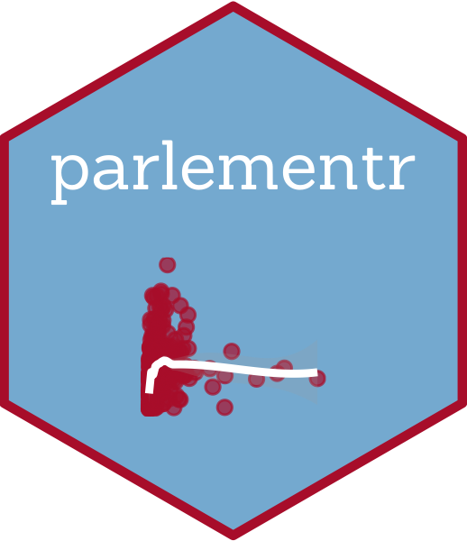

<!-- README.md is generated from README.Rmd. Please edit that file -->

# parlementr 

<!-- badges: start -->
<!-- badges: end -->

The goal of parlementr is to facilitate access from R to french
parliamentary data. Most of the functions make calls to the
nosdeputes.fr API.

## Installation

You can install the development version of parlementr from
[GitHub](https://github.com/) with:

``` r
devtools::install_github("malojan/parlementr")
#> Using github PAT from envvar GITHUB_PAT
#> Skipping install of 'parlementr' from a github remote, the SHA1 (26c6bd64) has not changed since last install.
#>   Use `force = TRUE` to force installation
```

## Example

This is a basic example which shows you how to solve a common problem:

``` r
library(parlementr)
## basic example code

get_mps(term = "15", type = "all")
#> # A tibble: 659 × 32
#>       id nom           nom_de_famille prenom sexe  date_naissance lieu_naissance
#>    <dbl> <chr>         <chr>          <chr>  <chr> <date>         <chr>         
#>  1     1 Cédric Rouss… Roussel        Cédric H     1972-10-10     Brest (Finist…
#>  2     2 Nadia Hai     Hai            Nadia  F     1980-03-08     Trappes (Yvel…
#>  3     3 Pascale Font… Fontenel-Pers… Pasca… F     1962-05-26     Mans (Sarthe) 
#>  4     4 Laurent Piet… Pietraszewski  Laure… H     1966-11-19     Saint-Denis (…
#>  5     5 Guillaume Ka… Kasbarian      Guill… H     1987-02-28     Marseille (Bo…
#>  6     6 Cyrille Isaa… Isaac-Sibille  Cyril… H     1958-04-30     Lyon 6 (Rhône)
#>  7     7 Guillaume Vu… Vuilletet      Guill… H     1967-06-20     Beauvais (Ois…
#>  8     8 Olivier Faure Faure          Olivi… H     1968-08-18     La Tronche (I…
#>  9     9 Pierre-Alain… Raphan         Pierr… H     1983-04-06     Choisy-le-Roi…
#> 10    10 Isabelle Mul… Muller-Quoy    Isabe… F     1967-11-08     Agen (Lot-et-…
#> # ℹ 649 more rows
#> # ℹ 25 more variables: num_deptmt <chr>, nom_circo <chr>, num_circo <chr>,
#> #   mandat_debut <date>, mandat_fin <date>, ancien_depute <dbl>,
#> #   groupe_sigle <chr>, parti_ratt_financier <chr>, sites_web <chr>,
#> #   emails <chr>, adresses <chr>, collaborateurs <chr>, autres_mandats <chr>,
#> #   anciens_autres_mandats <lgl>, anciens_mandats <chr>, profession <chr>,
#> #   place_en_hemicycle <dbl>, url_an <chr>, id_an <dbl>, slug <chr>, …
```

## Retrieve Mps activity

``` r
parlementr::get_activity(term = "16")
#> # A tibble: 560 × 41
#>       id nom           nom_de_famille prenom sexe  date_naissance lieu_naissance
#>    <dbl> <chr>         <chr>          <chr>  <chr> <date>         <chr>         
#>  1    29 Damien Abad   Abad           Damien H     1980-04-05     Nîmes (Gard)  
#>  2    71 Caroline Aba… Abadie         Carol… F     1976-09-07     Saint Martin …
#>  3   263 Nadège Aboma… Abomangoli     Nadège F     1975-09-15     Brazzaville (…
#>  4   567 Jean-Félix A… Acquaviva      Jean-… H     1973-03-19     Bastia (Haute…
#>  5   559 Damien Adam   Adam           Damien H     1989-06-28     Orléans (Loir…
#>  6   552 Éric Alauzet  Alauzet        Éric   H     1958-06-07     Nancy (Meurth…
#>  7    52 Xavier Alber… Albertini      Xavier H     1970-01-28     Royan (Charen…
#>  8    16 Laurent Alex… Alexandre      Laure… H     1973-06-09     Decazeville (…
#>  9   415 Henri Alfand… Alfandari      Henri  H     1979-10-02     Chambray-lès-…
#> 10    46 Franck Allis… Allisio        Franck H     1980-08-04     Marseille (Bo…
#> # ℹ 550 more rows
#> # ℹ 34 more variables: num_deptmt <chr>, nom_circo <chr>, num_circo <dbl>,
#> #   mandat_debut <date>, mandat_fin <lgl>, ancien_depute <dbl>,
#> #   groupe_sigle <chr>, parti_ratt_financier <chr>, sites_web <chr>,
#> #   emails <lgl>, anciens_mandats <lgl>, profession <chr>,
#> #   place_en_hemicycle <dbl>, url_an <chr>, id_an <dbl>, slug <chr>,
#> #   url_nosdeputes <chr>, url_nosdeputes_api <chr>, nb_mandats <dbl>, …
```

## Retrieve roll call votes

``` r
parlementr::get_votes(term = "16")
#> # A tibble: 2,519 × 15
#>    numero date       type      sort   titre          nombre_votants nombre_pours
#>     <dbl> <date>     <chr>     <chr>  <chr>                   <dbl>        <dbl>
#>  1      1 2022-07-11 solennel  rejeté la motion de …            146          146
#>  2      2 2022-07-11 ordinaire rejeté la motion de …            368          174
#>  3      3 2022-07-12 ordinaire rejeté l'amendement …            375          165
#>  4      4 2022-07-12 ordinaire adopté l'article pre…            342          177
#>  5      5 2022-07-12 ordinaire rejeté l'amendement …            379          180
#>  6      6 2022-07-12 ordinaire adopté l'amendement …            382          196
#>  7      7 2022-07-12 ordinaire rejeté l'amendement …            408          169
#>  8      8 2022-07-12 ordinaire rejeté l'amendement …            398           95
#>  9      9 2022-07-12 ordinaire adopté l'amendement …            392          386
#> 10     10 2022-07-12 ordinaire rejeté l'amendement …            338           91
#> # ℹ 2,509 more rows
#> # ℹ 8 more variables: nombre_contres <dbl>, nombre_abstentions <dbl>,
#> #   demandeurs <chr>, demandeurs_groupes_acronymes <chr>,
#> #   url_institution <chr>, url_nosdeputes <chr>, url_nosdeputes_api <chr>,
#> #   term <chr>
```

# Retrieve different organisms of the french parliament

``` r
parlementr::get_orga(term = "16", type =c("groupe"))
#> # A tibble: 11 × 12
#>       id orga_slug              nom   acronyme groupe_actuel couleur order type 
#>    <dbl> <chr>                  <chr> <chr>            <dbl>   <dbl> <dbl> <chr>
#>  1    12 democrate              Démo… MODEM                1  2.55e6     6 grou…
#>  2     1 deputes-non-inscrits   Dépu… NI                   1  1.65e8    10 grou…
#>  3    15 ecologiste-nupes       Écol… ECO                  1  1.51e7     3 grou…
#>  4     9 gauche-democrate-et-r… Gauc… GDR                  1  2.08e6     1 grou…
#>  5    16 horizons-et-apparentes Hori… HOR                  1  5.52e7     7 grou…
#>  6    13 la-france-insoumise-n… La F… LFI                  1  2.04e6     0 grou…
#>  7     8 les-republicains       Les … LR                   1  7.88e6     8 grou…
#>  8    17 libertes-independants… Libe… LIOT                 1  2.16e7     4 grou…
#>  9    11 rassemblement-national Rass… RN                   1  1.96e5     9 grou…
#> 10    10 renaissance            Rena… REN                  1  2.55e6     5 grou…
#> 11    14 socialistes-et-appare… Soci… SOC                  1  2.55e8     2 grou…
#> # ℹ 4 more variables: url_nosdeputes <chr>, url_nosdeputes_api <chr>,
#> #   term <chr>, orga_type <chr>
```
